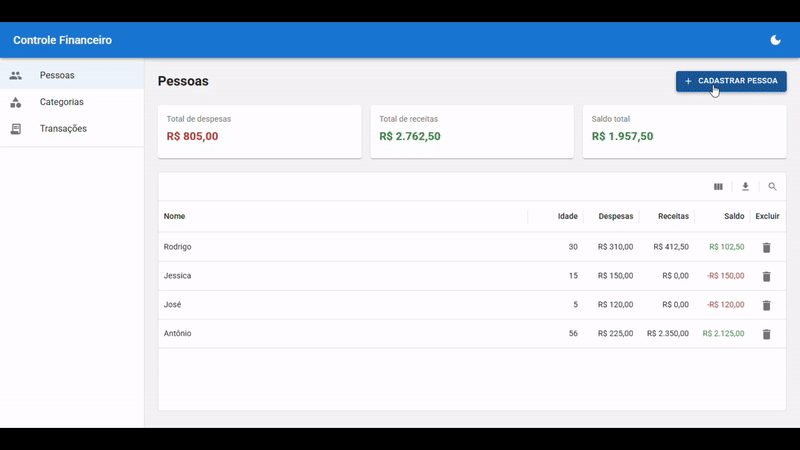

# Expense Manager

Aplicação full-stack para gestão de transações financeiras. Frontend em React 19 com TypeScript e Material-UI. Backend em .NET 9 com Entity Framework e SQL Server.



## 📋 Sobre o Projeto

O **Expense Manager** é uma aplicação full-stack que permite usuários gerenciar suas finanças de forma simples e eficiente. Com ele, é possível:

- **Cadastrar Pessoas**: Adicione contatos para rastrear transações por pessoa
- **Gerenciar Categorias**: Crie categorias de receita, despesa ou ambas
- **Registrar Transações**: Registre receitas e despesas associadas a pessoas e categorias
- **Visualizar Dados**: Acompanhe saldos, receitas totais e despesas totais

## 🛠️ Stack Tecnológico

### Frontend

- **React** 19.2.0 - Biblioteca UI
- **TypeScript** 5.9.3 - Tipagem estática
- **Vite** 7.2.4 - Build tool e dev server
- **Material-UI (MUI)** 7.3.7 - Design system e componentes acessíveis
- **React Hook Form** 7.71.1 - Gerenciamento de formulários eficiente
- **Zod** 4.3.6 - Validação de esquemas em runtime
- **React Query** (@tanstack/react-query) 5.90.20 - Gerenciamento de estado assíncrono e cache
- **React Router** 7.13.0 - Roteamento client-side
- **Axios** 1.13.3 - Cliente HTTP

### Backend

- **.NET** 9.0 - Framework
- **ASP.NET Core** 9.0 - Web API
- **Entity Framework Core** 9.0.0 - ORM
- **SQL Server** 2022 - Banco de dados (via Docker)

## 📦 Pré-requisitos

Antes de começar, certifique-se de ter instalado:

- **Docker** e **Docker Compose** 3.9+ - Para executar o SQL Server 2022
- **.NET 9 SDK** - [Download](https://dotnet.microsoft.com/download/dotnet/9.0)
- **Node.js 18+** e **npm** - [Download](https://nodejs.org/)
- **Git** - Para clonar o repositório

## 🚀 Como Rodar o Projeto

### 1. Clone o Repositório

(ou baixe o arquivo .zip pelo GitHub)

```bash
git clone https://github.com/rodrigoDeSouzaFernandes/expense-manager.git
cd expense-manager
```

### 2. Configure Variáveis de Ambiente

Crie um arquivo `.env` na raiz do projeto com a seguinte variável:

```env
DB_SA_PASSWORD=StrongPassword@123
```

**Importante**: Use uma senha segura (mínimo 8 caracteres, com maiúsculas, minúsculas, números e caracteres especiais).

### 3. Inicie o Container Docker

```bash
docker-compose up -d
```

Isso iniciará o container do SQL Server. Aguarde alguns segundos até que o serviço esteja completamente pronto.

### 4. Execute o Backend

```bash
cd server/FinancialControl.Api
dotnet run
```

A API estará disponível em `http://localhost:5280/api`

### 5. Execute o Frontend

Em outro terminal, na raiz do projeto:

```bash
cd client/financial-control-ui
npm install
npm run dev
```

A aplicação estará disponível em `http://localhost:5173`

## 📁 Estrutura do Projeto

```
expense-manager/
├── server/                          # Backend .NET
│   └── FinancialControl.Api/
│       ├── Controllers/             # Endpoints da API
│       ├── Models/                  # DTOs e Entities
│       ├── Services/                # Lógica de negócio
│       ├── Repositories/            # Acesso a dados
│       ├── Migrations/              # Migrações do banco
│       └── Program.cs               # Configuração da aplicação
│
├── client/                          # Frontend React
│   └── financial-control-ui/
│       ├── src/
│       │   ├── components/          # Componentes reutilizáveis
│       │   ├── features/            # Features (pessoas, categorias, transações)
│       │   ├── api/                 # Serviços de API
│       │   ├── hooks/               # Custom hooks
│       │   ├── context/             # Context API
│       │   ├── theme/               # Temas MUI
│       │   ├── utils/               # Funções utilitárias
│       │   ├── App.tsx              # Componente raiz
│       │   └── routes.tsx           # Definição de rotas
│       └── package.json
│
├── docker-compose.yml               # Configuração do Docker
└── README.md                        # Este arquivo
```

## ✨ Funcionalidades

### Pessoas

- ✅ Listar todas as pessoas com saldo consolidado
- ✅ Visualizar detalhes e transações de uma pessoa
- ✅ Cadastrar nova pessoa
- ✅ Deletar pessoa

### Categorias

- ✅ Listar categorias
- ✅ Criar categorias (Receita, Despesa ou Ambas)
- ✅ Deletar categoria

### Transações

- ✅ Listar todas as transações
- ✅ Criar transação (associando pessoa e categoria)
- ✅ Deletar transação

## 🔌 Endpoints da API

### Pessoas

- `GET /api/people` - Listar todas as pessoas
- `GET /api/people/{id}` - Obter pessoa por ID
- `POST /api/people` - Criar nova pessoa
- `DELETE /api/people/{id}` - Deletar pessoa

### Categorias

- `GET /api/categories` - Listar todas as categorias
- `POST /api/categories` - Criar nova categoria
- `DELETE /api/categories/{id}` - Deletar categoria

### Transações

- `GET /api/transactions` - Listar todas as transações
- `POST /api/transactions` - Criar nova transação
- `DELETE /api/transactions/{id}` - Deletar transação

## 🎨 Recursos de UX/Acessibilidade

- **Tema Claro/Escuro**: Alterne entre temas com preferência salva localmente
- **Design Responsivo**: Interface adaptada para desktop, tablet e mobile
- **Acessibilidade (a11y)**: Componentes MUI com suporte a leitores de tela
- **Validação em Tempo Real**: Feedback imediato em formulários
- **Tratamento de Erros**: Mensagens de erro claras e amigáveis

## Possíveis Melhorias

- [ ] **Testes Unitários** - Implementar testes com xUnit (backend) e Vitest (frontend)
- [ ] **Autenticação e Autorização** - Sistema de login/logout com JWT e roles de usuário
- [ ] **Data de Nascimento** - Substituir campo "idade" por data de nascimento com cálculo automático
- [ ] **Data da Transação** - Permitir ao usuário definir data customizada para transações (atualmente usa data atual)
- [ ] **Filtros e Paginação** - Filtros avançados nas listas (por data, categoria, pessoa)
- [ ] **Soft Delete** - Implementar exclusão lógica em vez de física
- [ ] **Auditoria** - Log de alterações (who, when, what) em transações e categorias
- [ ] **Internacionalização (i18n)** - Suporte a múltiplos idiomas

---

<div align="center">

## 👨‍💻 Desenvolvido por

**Rodrigo de Souza Fernandes**

[](https://www.linkedin.com/in/rodrigo-de-souza-fernandes/)
[](https://github.com/rodrigoDeSouzaFernandes)

---

<sub>© 2026 Expense Manager. Todos os direitos reservados.</sub>

</div>
